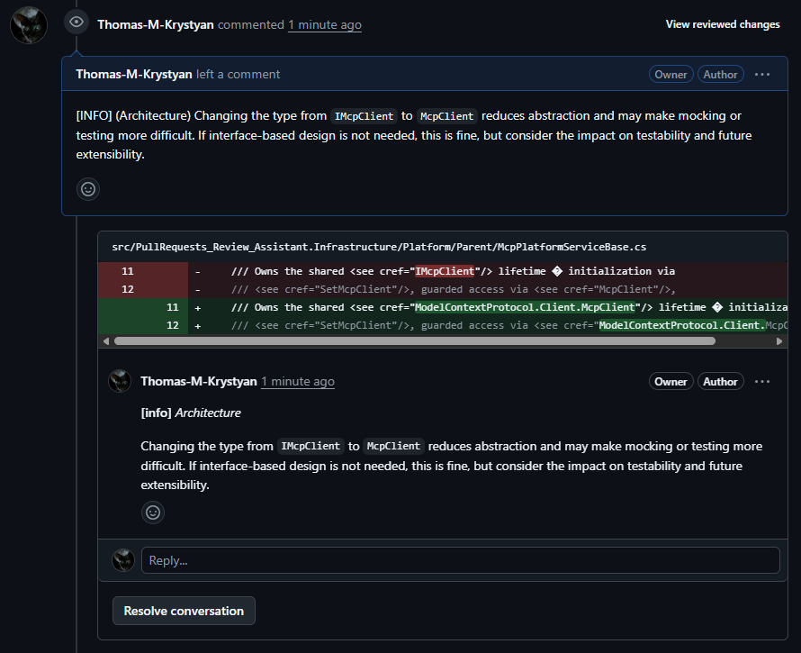

# PR Review Assistant

---

## 2. How to Start

### GitHub

#### Prerequisites

Before running the application against a GitHub repository, ensure the following are in place:

- **Node.js & npm** — required to run the MCP GitHub server via `npx`

  <details>

  - Install via [https://nodejs.org](https://nodejs.org) *(LTS version recommended)*
  - or from the terminal:

    **Windows** (via [Winget](https://learn.microsoft.com/windows/package-manager/winget/)):

    ```sh
    winget install OpenJS.NodeJS.LTS
    ```

    **Windows** (via [Chocolatey](https://chocolatey.org/)):

    ```sh
    choco install nodejs-lts
    ```

    **macOS** (via [Homebrew](https://brew.sh/)):

    ```sh
    brew install node
    ```

    **Linux** (Debian/Ubuntu):

    ```sh
    sudo apt install nodejs npm
    ```

  - After installation, verify with:

    ```sh
    node --version
    npx --version
    ```

  > **NOTE:** `npx` is bundled with `npm` and does not need to be installed separately.
  
  > **Windows Troubleshooting:** If running `npx` in PowerShell produces an *"is not digitally signed"*
    error, run the following command once in PowerShell **as Administrator**, then retry:

  ```powershell
  Set-ExecutionPolicy -Scope CurrentUser -ExecutionPolicy RemoteSigned
  ```

  </details>

- **GitHub Copilot subscription** — the application uses GitHub Copilot SDK agents

- **GitHub Personal Access Token (PAT)** — required for authenticating with GitHub to read PR files and post review comments

- **GitHub Copilot CLI** — the application relies on the `copilot` command-line tool to run the MCP server locally, which is used for processing reviews via Copilot agents

  <details>

  - Install via [https://github.com/github/cli/releases](https://github.com/github/cli/releases)
  - or from the terminal:

    **Windows** (via [Winget](https://learn.microsoft.com/windows/package-manager/winget/)):

    ```sh
    winget install GitHub.cli
    ```

    **Windows** (via [Chocolatey](https://chocolatey.org/)):

    ```sh
    choco install gh
    ```

    **macOS** (via [Homebrew](https://brew.sh/)):

    ```sh
    brew install gh
    ```

    **Linux** (Debian/Ubuntu):

    ```sh
    sudo apt install gh
    ```

  - After installation, verify with:

    ```sh
    copilot --version
    ```
    
    ##### Resources

    - [**GitHub Docs:** Installing GitHub Copilot CLI](https://docs.github.com/en/copilot/how-tos/set-up/install-copilot-cli) - Guide on how to install **GitHub Copilot CLI**
    - [**GitHub Docs:** Using GitHub Copilot CLI](https://docs.github.com/en/copilot/how-tos/use-copilot-agents/use-copilot-cli) - Guide on how to use **GitHub Copilot CLI**

  </details>

---

#### Create Personal Access Token

The application authenticates with GitHub using a **classic Personal Access Token (PAT)**.

1. Go to **GitHub → Settings → Developer settings → Personal access tokens → Tokens (classic)**
2. Click **Generate new token (classic)**
3. Fill in the form:
   - **Note:** `PR Review Assistant - Local` *(or any descriptive name)*
   - **Expiration:** choose an appropriate duration (e.g. `30 days`)
   - **Scopes:** tick only **`repo`** — this grants full access to private repositories, which is required to read PR files and post review comments
4. Click **Generate token**
5. **Copy the token immediately** — GitHub will not show it again

---

#### Store the Token (User Secrets)

The token is stored locally using .NET User Secrets, which keeps it outside the repository and prevents accidental commits.

In Visual Studio, right-click the `PullRequests_Review_Assistant.Console` project and select **Manage User Secrets**.

This opens the file at:

> `%APPDATA%\Microsoft\UserSecrets\pr-review-assistant-local\secrets.json`

Add your token:

```json
{
  "github-pat": "ghp_YourTokenHere"
}
```

---

## 3. Run the Application

Launch the application from Visual Studio (`Ctrl+F5`) or from the terminal:

```sh
dotnet run --project src/PullRequests_Review_Assistant.Console
```

When prompted:

| Prompt | Value |
|--------|-------|
| **Tier** | Your Copilot plan (e.g. `Free`, `Pro`, `Business`) |
| **Platform** | `GitHub` |

#### Tier prompt example

```sh
[Config] No tier specified. Falling back to interactive selection.
[Config] Select a Tier:
  [1] Free
  [2] Student
  [3] Pro
  [4] ProPlus
  [5] Business
  [6] Enterprise
Enter a number (1-6):
```

#### Platform prompt example

```sh
[Model] Using primary model: claude-opus-4.6
[Config] No platform specified. Falling back to interactive selection.
[Config] Select a Platform:
  [1] GitHub
  [2] GitLab
  [3] Bitbucket
Enter a number (1-3):
```

> **NOTE:** Both prompts can be skipped by passing arguments directly:

```sh
dotnet run --project src/PullRequests_Review_Assistant.Console -- --tier=Free --platform=GitHub
```

---

#### Review a Pull Request

Once at the `>` prompt, use the `review` command:

```sh
review <Platform> <Your-GitHub-Name> <Repository-Name> <Pull-Request-Id> [options]
```

- **Platform:** GitHub, github, or similar
- **Your-GitHub-Name:** the alias appearing after "https://github.com/" in the URL of your repository, for example "Thomas-M-Krystyan"
- **Repository-Name:** the name of your repository (not the full URL), for example: "PullRequest_Review_Assistant"
- **Pull-Request-Id:** the numeric ID of the pull request, which can be found in the URL of the PR after "https://github.com/owner_name/repository_name/pull/", for example: "123"
- **Options:** will be displayed in the console if you type `--help`, `--h` or `-h`</br>
  Most of the review options can be combined using bitwise flags: --x --y => (x, y)</br>
  or by `--area=` where grouped categories are defined (e.g. `--area=CoreReview`).

  > Check the file [ReviewArea.cs](src/PullRequests_Review_Assistant.Domain/Enums/ReviewArea.cs) for more details.

##### Language proficiency

You can specify the target programming language used for core review by:

- passing `--lang=<language>` command argument (e.g. `--lang=C#`) to the used for the current review
- passing `language <language>` command argument (e.g. `language Python`) which will be used as a global
  agent setting for all subsequent reviews in the current session until changed again or reset
- skip both, and let the system infer the language(s) from the PR files (based on their extensions) — this
  may however lead to less accurate reviews if the language cannot be confidently determined (e.g., code
  snippets placed in plane text or markup files)

##### Examples of usage

- **Minimal example** — the default core review areas:

```sh
review github John-Smith Calculator_App 1 --lang=C# --areas=CoreReview
```

> **NOTE:** `CoreReview` is a shorthand for the main review areas: Performance, Architecture, Vulnerabilities,
  and Code Smells (so you don't have to specify each one separately). This specific review area can be also
  skipped since it's a default configuration for reviews, but it's included here for demonstration purposes.

- **Targeted example** — specific areas only:

```sh
review github SamanthaB_97 ImageProcessingRepo 37 --lang=Python --docs --naming --errors
```

- **Full example** — all areas and suggestions:

```sh
review GitHub WiseCompany alpha-Communication_Platform 8514 --all
```

Review comments are automatically **posted back to the GitHub pull request** upon completion.

The review comments are posted under the credentials of the GitHub user whose Personal Access Token (PAT)
is configured in the application.

---

#### Expected output in the console:

```sh
[GitHub Auth] Authenticated successfully.

╔════════════════════════════════════════════════════════════════════╗
║                  PR Review Assistant — Commands                    ║
╠════════════════════════════════════════════════════════════════════╣
...
...

║  exit / quit        Exit the application                           ║
╚════════════════════════════════════════════════════════════════════╝

> review GitHub Thomas-M-Krystyan PullRequests_Review_Assistant 1 --all

[Review] Starting review for GitHub Thomas-M-Krystyan/PullRequests_Review_Assistant PR #1
[Review] Areas: All
[Orchestrator] Found 1 file(s) to review.
[Orchestrator] Reviewing: [
  {
    "sha": "f3c9b7a1e4d28c5f0d91ab7c42ef89d12b7e3c6a",
    "filename": "README.md",
    "status": "modified",
    "additions": 190,
    "deletions": 1,
    "changes": 191,
    "blob_url": ...
  },
  {...}
]
[Orchestrator] Total comments generated: 5
[Orchestrator] All comments posted successfully.
[Review] Completed with 5 comment(s).

>
```

---
#### Review Comments on GitHub



---

#### Exit the Application

- Type `exit` or `quit` at the prompt, **or**
- Press `Ctrl+C` for graceful cancellation

---

## 4. Architecture

```
PullRequests_Review_Assistant.sln
│
├── src/
│   ├── PullRequests_Review_Assistant.Application/
│   │   ├── Builders/
│   │   │   ├── Interface/
│   │   │   │   └── IReviewConfigurationBuilder.cs
│   │   │   └── ReviewConfigurationBuilder.cs
│   │   ├── Commands/
│   │   │   └── ConsoleCommandHandler.cs
│   │   ├── Services/
│   │   │   └── CodeReviewOrchestrator.cs
│   │   └── Utilities/
│   │       └── ConsolePrompt.cs
│   │
│   ├── PullRequests_Review_Assistant.Console/
│   │   └── Program.cs
│   │
│   ├── PullRequests_Review_Assistant.Domain/
│   │   ├── Entities/
│   │   │   ├── PullRequestFile.cs
│   │   │   └── ReviewComment.cs
│   │   ├── Enums/
│   │   │   ├── PlatformType.cs
│   │   │   ├── ReviewArea.cs
│   │   │   └── SubscriptionTier.cs
│   │   ├── Interfaces/
│   │   │   ├── IAuthStrategy.cs
│   │   │   ├── ICodeReviewAgent.cs
│   │   │   ├── ILanguageAgent.cs
│   │   │   ├── IModelConfigProvider.cs
│   │   │   ├── IRepositoryPlatformService.cs
│   │   │   └── ISecretsProvider.cs
│   │   ├── Templates/
│   │   │   └── SystemPromptTemplates.cs
│   │   └── ValueObjects/
│   │       ├── ModelPreference.cs
│   │       └── ReviewConfiguration.cs
│   │
│   └── PullRequests_Review_Assistant.Infrastructure/
│       ├── Agents/
│       │   ├── CopilotCodeReviewAgent.cs
│       │   └── CopilotLanguageAgent.cs
│       ├── Auth/
│       │   └── Factory/
│       │   │   └── AuthStrategyFactory.cs
│       │   ├── BitbucketAuthStrategy.cs
│       │   ├── GitHubAuthStrategy.cs
│       │   └── GitLabAuthStrategy.cs
│       ├── Configuration/
│       │   └── ModelConfigProvider.cs
│       ├── Extensions/
│       │   └── StringExtensions.cs
│       ├── Platform/
│       │   ├── Parent/
│       │   │   └── McpPlatformServiceBase.cs 
│       │   ├── BitbucketPlatformService.cs
│       │   ├── GitHubPlatformService.cs
│       │   └── GitLabPlatformService.cs
│       └── Secrets/
│           └── AzureKeyVaultSecretsProvider.cs
```